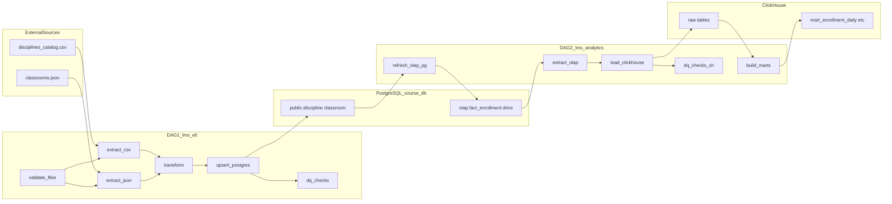
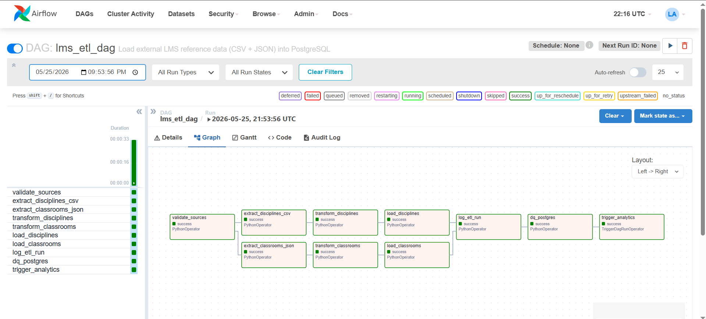
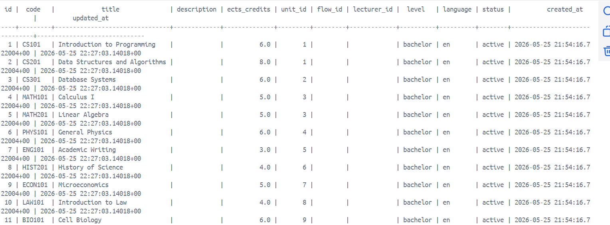
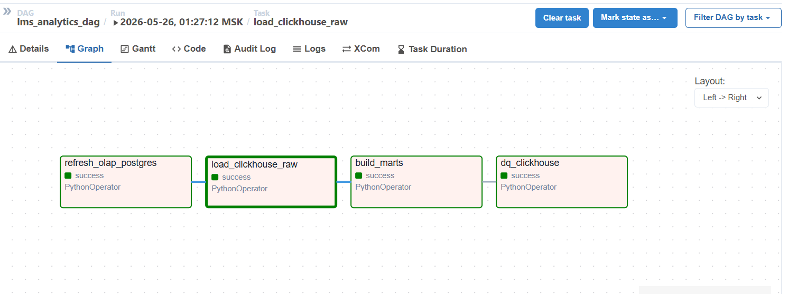
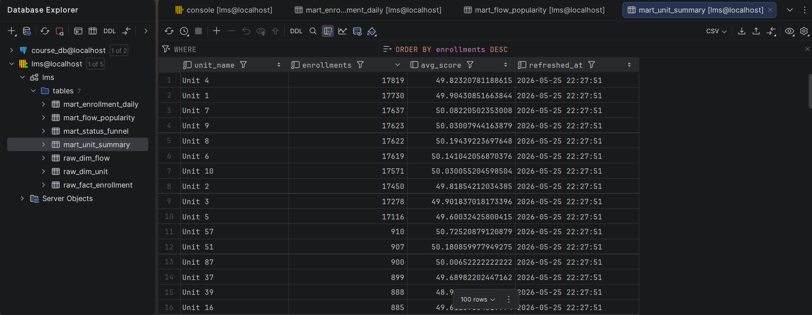

# Отчёт: Airflow ETL + Analytics для LMS



## 1. Какие источники данных выбраны

| Источник | Тип | Файл | Назначение |
|----------|-----|------|------------|
| Реестр дисциплин вуза-партнёра | **CSV** | `data/external/disciplines_catalog.csv` | Справочник дисциплин: код, название, ECTS, уровень, факультет |
| Система управления кампусом | **JSON** | `data/external/classrooms.json` | Аудитории: здание, номер, кампус, вместимость, оборудование |

Оба источника — внешние по отношению к основной БД и загружаются оркестратором Airflow.

## 2. Какие таблицы проекта пополняются (DAG 1)

| Таблица PostgreSQL | Операция |
|--------------------|----------|
| `discipline` | UPSERT по `code` |
| `classroom` | UPSERT по `(building, room_number)` |
| `etl_load_log` | Журнал загрузки (идемпотентность по `dag_run_id` + `source_name`) |

Связь дисциплин с факультетом: `unit.code` = `unit_code` из CSV (коды `UNIT1`…`UNIT10` задаются миграцией V6).

## 3. Как устроен DAG 1 (`lms_etl_dag`)

**Файл:** `airflow/dags/lms_etl_dag.py`

```
validate_sources
    ├── extract_disciplines_csv → transform_disciplines → load_disciplines
    └── extract_classrooms_json → transform_classrooms → load_classrooms
            → log_etl_run → dq_postgres → trigger_analytics
```

| Задача | Действие |
|--------|----------|
| `validate_sources` | Проверка наличия файлов, заголовков CSV, схемы JSON |
| `extract_*` | Чтение CSV/JSON в staging (`data/staging/`) |
| `transform_*` | Нормализация, дедупликация, валидация ECTS и capacity |
| `load_*` | UPSERT в PostgreSQL |
| `log_etl_run` | Запись в `etl_load_log` |
| `dq_postgres` | Сверка количества строк, отсутствие orphan `unit_id` |
| `trigger_analytics` | Запуск `lms_analytics_dag` |




## 4. Как устроен DAG 2 (`lms_analytics_dag`)

**Файл:** `airflow/dags/lms_analytics_dag.py`

```
refresh_olap_postgres → load_clickhouse_raw → build_marts → dq_clickhouse
```

| Задача | Действие |
|--------|----------|
| `refresh_olap_postgres` | Выполняет `db/scripts/refresh_olap.sql` (синхронизация схемы `olap`) |
| `load_clickhouse_raw` | TRUNCATE raw-таблиц + INSERT из `olap.*` |
| `build_marts` | Пересчёт витрин в ClickHouse |
| `dq_clickhouse` | Сверка counts PG vs CH, проверка витрин |



## 5. Какие таблицы создаются в ClickHouse

### Raw (снимок из PostgreSQL OLAP)

- `lms.raw_fact_enrollment`
- `lms.raw_dim_flow`
- `lms.raw_dim_unit`

### Витрины (marts)

- `lms.mart_enrollment_daily`
- `lms.mart_flow_popularity`
- `lms.mart_status_funnel`
- `lms.mart_unit_summary`

DDL: `clickhouse/init/01_schema.sql`, `clickhouse/init/02_marts.sql`.



## 6. Какая аналитическая витрина построена

Звёздная модель в PostgreSQL (`olap.*`) реплицируется в ClickHouse; агрегаты пересчитываются в marts.

| Витрина | Бизнес-вопрос |
|---------|---------------|
| `mart_enrollment_daily` | Динамика записей на курсы по дням |
| `mart_flow_popularity` | Самые популярные потоки (курсы) |
| `mart_status_funnel` | Конверсия / доля статусов enrollment |
| `mart_unit_summary` | Нагрузка по факультетам (unit) |

## 7. Какие метрики считаются

| Витрина | Метрики |
|---------|---------|
| `mart_enrollment_daily` | `enrollments`, `avg_score`, `avg_attendance` |
| `mart_flow_popularity` | `total_enrollments`, `completed_cnt`, `dropped_cnt`, `completion_rate` |
| `mart_status_funnel` | `cnt`, `pct` по статусу |
| `mart_unit_summary` | `enrollments`, `avg_score` по `unit_name` |

## 8. Как обеспечена идемпотентность

| Слой | Механизм |
|------|----------|
| `discipline`, `classroom` | `ON CONFLICT … DO UPDATE` |
| `etl_load_log` | `UNIQUE (dag_run_id, source_name)` |
| OLAP PostgreSQL | `TRUNCATE` + полная перезаливка |
| ClickHouse raw/marts | `TRUNCATE` + `INSERT` при каждом run |

Повторный запуск DAG не создаёт дубликатов справочников.

## 9. Какие проверки качества данных реализованы

**DAG 1 (`dq_postgres`):**
- CSV: непустые `code`, `ects_credits > 0`
- JSON: обязательные поля, `capacity > 0`
- После загрузки: `COUNT(discipline)` = число строк CSV
- Нет дисциплин с `unit_id IS NULL`

**DAG 2 (`dq_clickhouse`):**
- `count(olap.fact_enrollment)` = `count(raw_fact_enrollment)`
- `mart_enrollment_daily` не пустая, `sum(enrollments) > 0`
- `sum(pct)` в funnel ≈ 100%

При ошибке задача падает с `AirflowException`, DAG помечается failed.

## 10. Как запустить проект

### Предварительные требования

- Docker Desktop

### Шаг 1. Поднять PostgreSQL и применить миграции

```powershell
docker compose up -d postgres
docker compose run --rm flyway migrate
```

### Шаг 2. Заполнить OLTP тестовыми данными

Выполнить `db/scripts/fill_data.sql`.

### Шаг 3. ClickHouse

```powershell
docker compose up -d clickhouse
```

При первом запуске применятся скрипты из `clickhouse/init/`.

Пользователь `default` / пароль **`lmspass`** (файл `clickhouse/users.d/default-user.xml`).

### Шаг 4. Airflow

```powershell
docker compose up -d airflow-init
docker compose up -d airflow-webserver airflow-scheduler
```

- UI: http://localhost:8080  
- Логин: `admin` / `admin`

### Шаг 5. Запуск DAG

1. В UI включить (unpause) `lms_etl_dag` и `lms_analytics_dag`
2. Trigger `lms_etl_dag` — автоматически запустит analytics

Или из CLI:

```powershell
docker exec airflow_scheduler airflow dags unpause lms_etl_dag
docker exec airflow_scheduler airflow dags unpause lms_analytics_dag
docker exec airflow_scheduler airflow dags trigger lms_etl_dag
```

### Шаг 6. Проверка результатов

```sql
-- PostgreSQL
SELECT COUNT(*) FROM discipline;
SELECT COUNT(*) FROM classroom;
SELECT * FROM etl_load_log ORDER BY loaded_at DESC LIMIT 5;

-- ClickHouse (http://localhost:8123 или clickhouse-client)
SELECT count() FROM lms.mart_flow_popularity;
```
