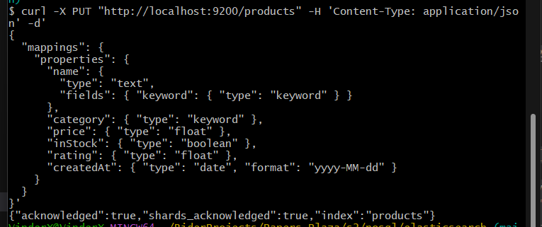
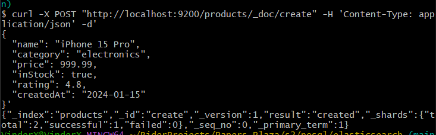
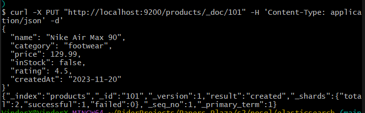
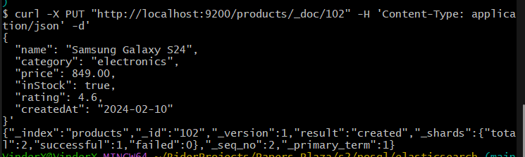
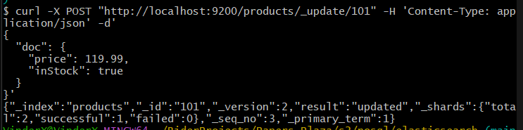
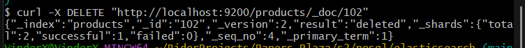
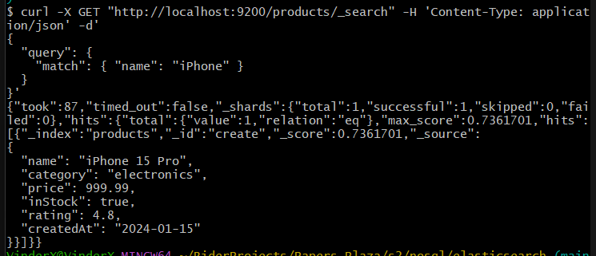
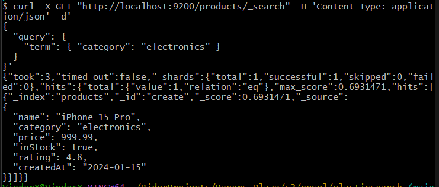
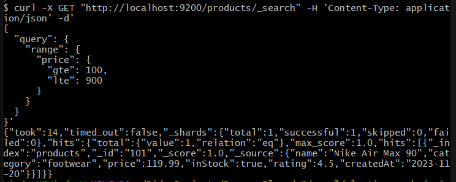
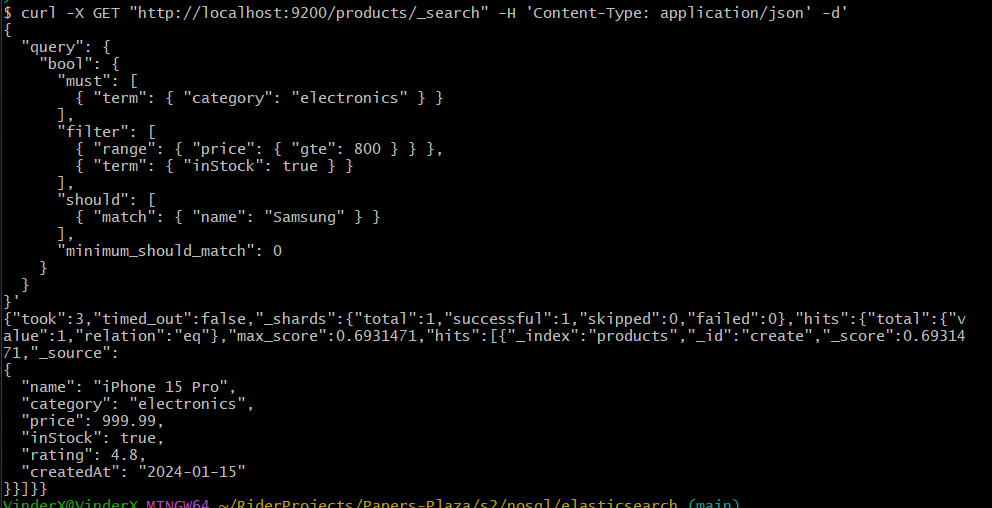

## 1. Поднять Elasticsearch через Docker

docker-compose.yml в той же директории

## 2. Создать индекс products.

```
curl -X PUT "http://localhost:9200/products" -H 'Content-Type: application/json' -d'
{
  "mappings": {
    "properties": {
      "name": {
        "type": "text",
        "fields": { "keyword": { "type": "keyword" } }
      },
      "category": { "type": "keyword" },
      "price": { "type": "float" },
      "inStock": { "type": "boolean" },
      "rating": { "type": "float" },
      "createdAt": { "type": "date", "format": "yyyy-MM-dd" }
    }
  }
}'
```



## 3. Заполнить индекс тестовыми данными с помощью методов PUT или POST.
То же самое что и пункт 4, так что идём дальше
## 4. Выполнить операции с документами:

- Создать документ

```
curl -X POST "http://localhost:9200/products/_doc/create" -H 'Content-Type: application/json' -d'
{
  "name": "iPhone 15 Pro",
  "category": "electronics",
  "price": 999.99,
  "inStock": true,
  "rating": 4.8,
  "createdAt": "2024-01-15"
}'
```



- Добавить документ с указанным id;

```
curl -X PUT "http://localhost:9200/products/_doc/101" -H 'Content-Type: application/json' -d'
{
  "name": "Nike Air Max 90",
  "category": "footwear",
  "price": 129.99,
  "inStock": false,
  "rating": 4.5,
  "createdAt": "2023-11-20"
}'
```




- Обновить документ

```
curl -X POST "http://localhost:9200/products/_update/101" -H 'Content-Type: application/json' -d'
{
  "doc": {
    "price": 119.99,
    "inStock": true
  }
}'
```



- Удалить документ

```
curl -X DELETE "http://localhost:9200/products/_doc/102"
```



## 5. Написать и выполнить запросы:

- Поиск по названию товара
- Запрос с использованием match

```
curl -X GET "http://localhost:9200/products/_search" -H 'Content-Type: application/json' -d'
{
  "query": {
    "match": { "name": "iPhone" }
  }
}'
```



- Запрос с использованием term

```
curl -X GET "http://localhost:9200/products/_search" -H 'Content-Type: application/json' -d'
{
  "query": {
    "term": { "category": "electronics" }
  }
}'
```



- Запрос с использованием range

```
curl -X GET "http://localhost:9200/products/_search" -H 'Content-Type: application/json' -d'
{
  "query": {
    "range": {
      "price": {
        "gte": 100,
        "lte": 900
      }
    }
  }
}'
```



- Запрос с использованием bool с комбинацией условий.

```
curl -X GET "http://localhost:9200/products/_search" -H 'Content-Type: application/json' -d'
{
  "query": {
    "bool": {
      "must": [
        { "term": { "category": "electronics" } }
      ],
      "filter": [
        { "range": { "price": { "gte": 800 } } },
        { "term": { "inStock": true } }
      ],
      "should": [
        { "match": { "name": "Samsung" } }
      ],
      "minimum_should_match": 0
    }
  }
}'
```

