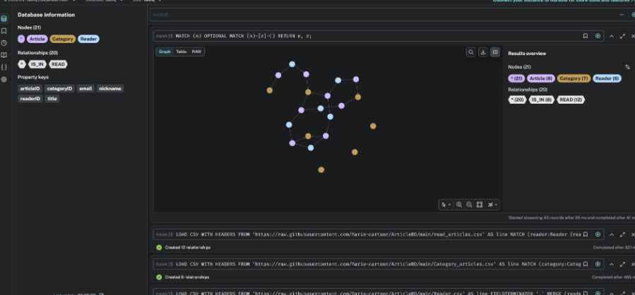
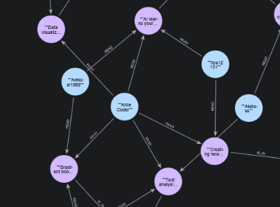
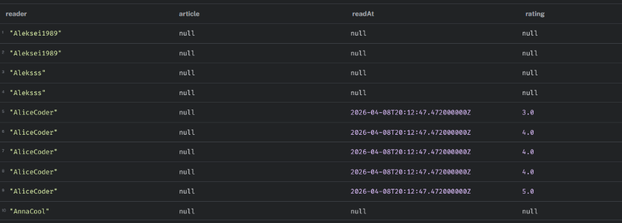
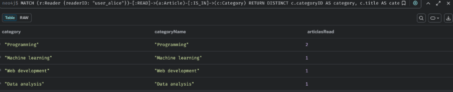
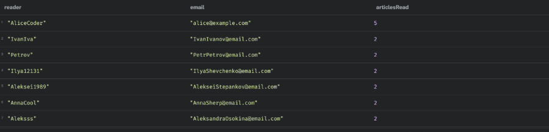
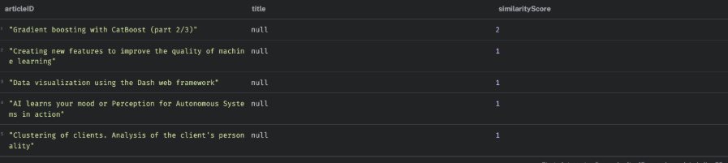
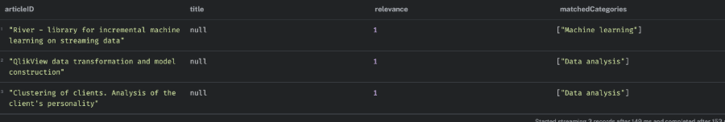

## Подготовка
1) Запустить Neo4j контейнер 
2) Импортировать датасет из README.md

Результат:


## Вставка

1) Добавить категорию

```
MERGE (c:Category {categoryID: "python-dev"})
  ON CREATE SET c.title = "Python-разработка",
                c.description = "Статьи про Python и экосистему",
                c.createdAt = datetime();
```

2) Добавить статью

```
MERGE (a:Article {articleID: "asyncio-guide"})
  ON CREATE SET a.title = "Полное руководство по asyncio",
                a.content = "Как работать с асинхронностью в Python...",
                a.publishedAt = date("2026-04-01"),
                a.views = 0;

// Связать статью с категорией
MATCH (a:Article {articleID: "asyncio-guide"})
MATCH (c:Category {categoryID: "python-dev"})
MERGE (a)-[:IS_IN]->(c);
```

3) Добавить читателя, добавить связь с 3-5 статьями

```
// Создаём читателя
MERGE (r:Reader {readerID: "user_alice"})
  ON CREATE SET r.nickname = "AliceCoder",
                r.email = "alice@example.com",
                r.joinedAt = datetime();

// Находим 5 случайных статей и создаём связи READ
MATCH (r:Reader {readerID: "user_alice"})
MATCH (a:Article)
WHERE a.articleID IS NOT NULL
WITH r, a
ORDER BY rand()
LIMIT 5
CREATE (r)-[:READ {readAt: datetime(), rating: round(rand() * 2 + 3)}]->(a);
```



## Запросы

1. Отобразить всех пользователей, статьи и связи между ними

```
MATCH (r:Reader)-[rel:READ]->(a:Article)
RETURN r.nickname AS reader, 
       a.title AS article,
       rel.readAt AS readAt,
       rel.rating AS rating
ORDER BY r.nickname, rel.readAt DESC;
```



2. Выбрать пользователя и найти категории, которые он читает

```
MATCH (r:Reader {readerID: "user_alice"})-[:READ]->(a:Article)-[:IS_IN]->(c:Category)
RETURN DISTINCT c.categoryID AS category,
                c.title AS categoryName,
                count(a) AS articlesRead
ORDER BY articlesRead DESC;
```



3. Найти самых активных читателей (топ-10) (посчитать, кто читает больше всего статей)

```
MATCH (r:Reader)-[:READ]->(a:Article)
RETURN r.nickname AS reader,
       r.email AS email,
       count(a) AS articlesRead
ORDER BY articlesRead DESC
LIMIT 10;
```



4. Выбрать статью и найти похожие статьи (статьи, которые читают те же пользователи)

```
// Находим пользователей, читавших целевую статью
MATCH (target:Article {articleID: "Text analysis by means of the Stanza library"})<-[:READ]-(reader:Reader)

// Находим другие статьи, которые читали те же пользователи
MATCH (reader)-[:READ]->(similar:Article)
WHERE similar.articleID <> "Text analysis by means of the Stanza library"

// Сортируем по количеству общих читателей
WITH similar, count(DISTINCT reader) AS commonReaders
ORDER BY commonReaders DESC
LIMIT 10

RETURN similar.articleID AS articleID,
       similar.title AS title,
       commonReaders AS similarityScore;
```



5) Рекомендации по категориям
  - найти категории, которые читает пользователь
  - предложить статьи из этих категорий, которые он ещё не читал

```
// 1. Находим категории, которые читает пользователь
MATCH (r:Reader {readerID: "user_alice"})-[:READ]->(a:Article)-[:IS_IN]->(c:Category)
WITH r, collect(DISTINCT c) AS knownCategories,
     collect(DISTINCT a) AS readArticles

// 2. Находим статьи из этих категорий, которые пользователь ещё не читал
MATCH (c:Category)<-[:IS_IN]-(recommended:Article)
WHERE c IN knownCategories
  AND NOT recommended IN readArticles
  AND NOT EXISTS((r)-[:READ]->(recommended))

// 3. Собираем названия категорий и считаем вес рекомендации
WITH r, recommended, 
     collect(DISTINCT c.title) AS matchedCategoryTitles,
     count(DISTINCT c) AS categoryWeight
ORDER BY categoryWeight DESC, COALESCE(recommended.views, 0) DESC
LIMIT 10

RETURN recommended.articleID AS articleID,
       recommended.title AS title,
       categoryWeight AS relevance,
       matchedCategoryTitles AS matchedCategories;
```

