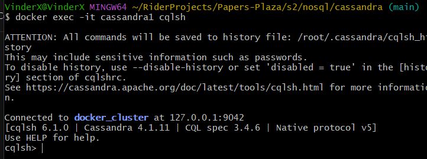
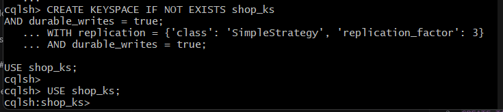
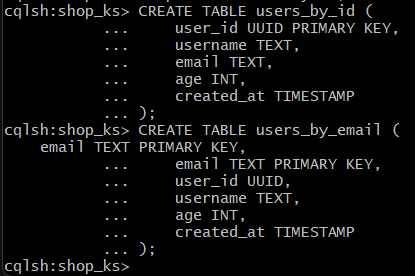
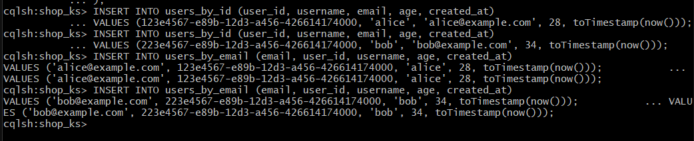
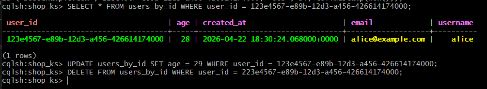
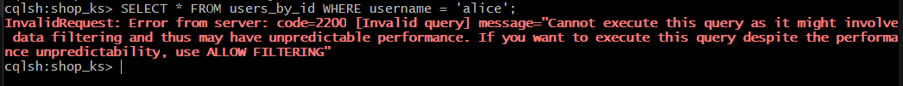
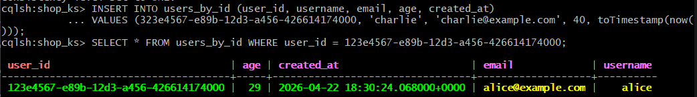
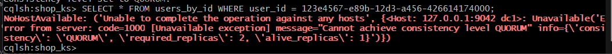

# Поднять кластер Cassandra...
...из 3 нод с помощью Docker Compose. Создать keyspace с replication_factor = 3 и убедиться, что все ноды доступны.

```
docker compose up -d
```



Создание keyspace:



# Создать две таблицы...
...с одинаковыми данными, но спроектированные под разные запросы (например, по разным ключам). 
Заполнить обе таблицы одинаковыми данными.

```
-- доступ по ID пользователя
CREATE TABLE users_by_id (
    user_id UUID PRIMARY KEY,
    username TEXT,
    email TEXT,
    age INT,
    created_at TIMESTAMP
);

-- доступ по email
CREATE TABLE users_by_email (
    email TEXT PRIMARY KEY,
    user_id UUID,
    username TEXT,
    age INT,
    created_at TIMESTAMP
);
```



# Выполнить операции INSERT, SELECT, UPDATE и DELETE. 
Попробовать выполнить SELECT по полю, которое не является частью ключа, и получить ошибку.

```
-- Вставка в users_by_id
INSERT INTO users_by_id (user_id, username, email, age, created_at) 
VALUES (123e4567-e89b-12d3-a456-426614174000, 'alice', 'alice@example.com', 28, toTimestamp(now()));

INSERT INTO users_by_id (user_id, username, email, age, created_at) 
VALUES (223e4567-e89b-12d3-a456-426614174000, 'bob', 'bob@example.com', 34, toTimestamp(now()));

-- Дублируем те же данные в users_by_email
INSERT INTO users_by_email (email, user_id, username, age, created_at) 
VALUES ('alice@example.com', 123e4567-e89b-12d3-a456-426614174000, 'alice', 28, toTimestamp(now()));

INSERT INTO users_by_email (email, user_id, username, age, created_at) 
VALUES ('bob@example.com', 223e4567-e89b-12d3-a456-426614174000, 'bob', 34, toTimestamp(now()));
```



```
-- SELECT по PK
SELECT * FROM users_by_id WHERE user_id = 123e4567-e89b-12d3-a456-426614174000;

-- UPDATE по PK
UPDATE users_by_id SET age = 29 WHERE user_id = 123e4567-e89b-12d3-a456-426614174000;

-- DELETE по PK
DELETE FROM users_by_id WHERE user_id = 223e4567-e89b-12d3-a456-426614174000;
```



```
-- SELECT не по ПК
SELECT * FROM users_by_id WHERE username = 'alice';
```



# Остановить одну из нод кластера и проверить, 
что операции чтения и записи продолжают работать. Убедиться, что данные остаются доступными.

```
docker compose stop cassandra3
```
Проверка того, что всё нормально:



```
CONSISTENCY QUORUM; -- теперь надо 2/3 для работы
```

```
docker compose stop cassandra2
```

